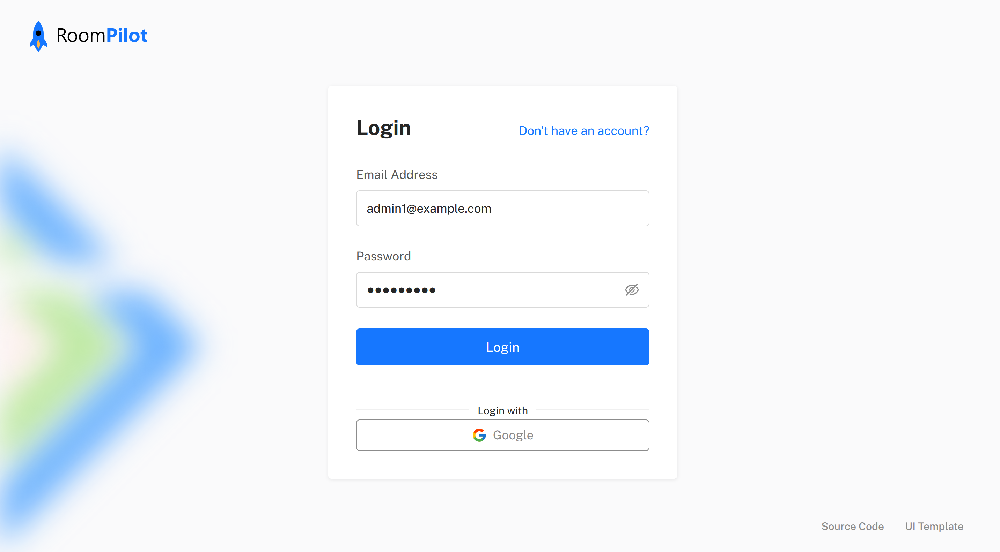
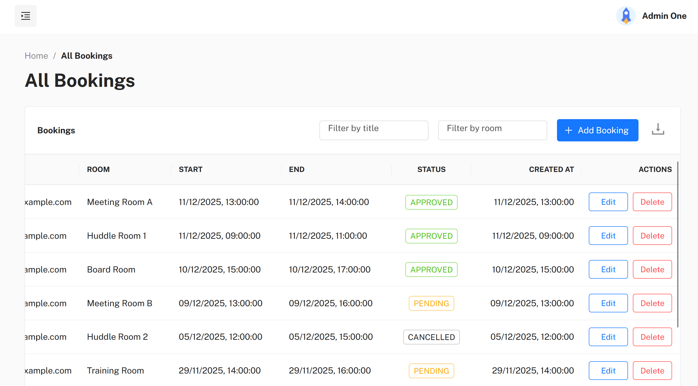
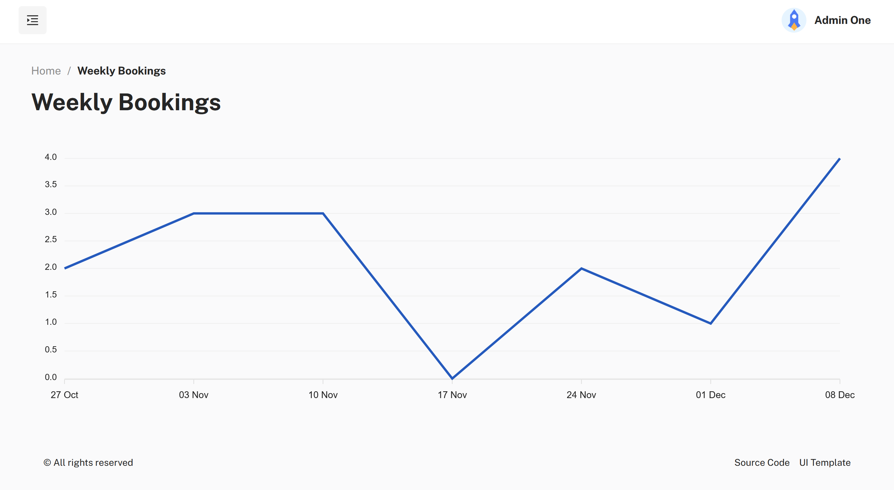
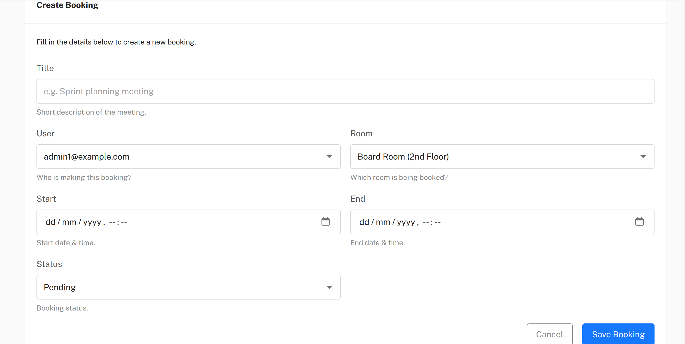

# RoomPilot - Full-Stack Booking App

Full-stack (React, Next.js, PostgreSQL) web application for booking meeting rooms, originally created as teaching material for UCL Computer Science students. Available at [roompilot-app.com](https://roompilot-app.com)

## Tech Stack

- **Core:** React, Next.js
- **Styling:** Tailwind CSS, MUI (Material UI)
- **Auth:** NextAuth
- **Data:** Prisma, PostgreSQL (Neon)
- **Hosting:** Vercel
- **Previous deployment:** Docker image deployed on an Azure VM (now migrated to Vercel + Neon)

## Features

- CRUD functionality via Next.js and Prisma
- Data visualisation via MUI
- Mobile optimisation via Tailwind
- External provider authentication via Google OAuth
- Role-based access control via NextAuth
- Containerisation via Docker

## Mantis UI Template

This project incorporates and adapts select components from a Material UI template, available [here](https://mui.com/store/items/mantis-react-admin-dashboard-template)

## Source Code Availability

Only a **skeleton** of the source code is open-sourced. **Reasons:**

1. Parts of the UI were built using a paid, closed-source Material UI template. That licensed code is **not** included in this repository

2. Originally developed as UCL teaching material. Due to redistribution restrictions, the full source code is **not** publicly available

## Screenshots

